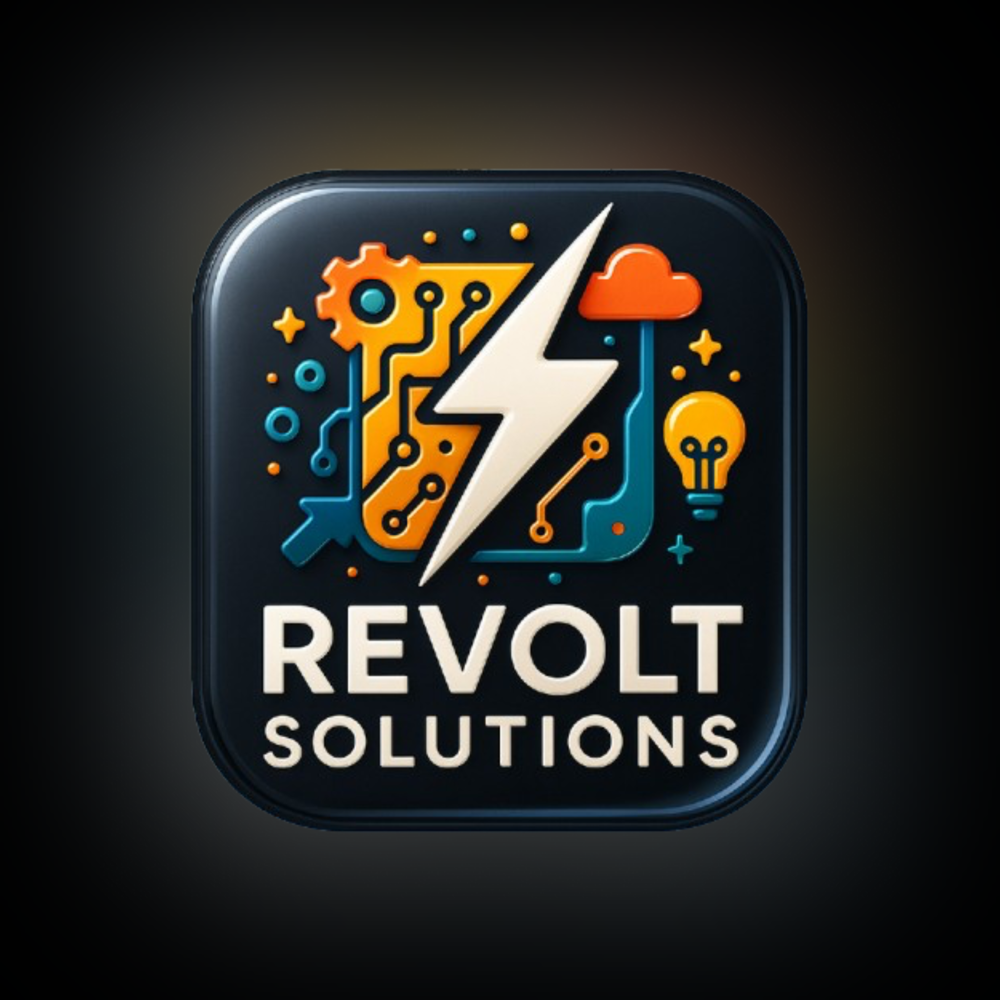

# API 2º Semestre - Banco de dados (Noturno).

# Revolt Solutions

      
      <h2 align="center"> Revolt Solutions</h2>

  | <a href ="#desafio"> Desafio</a>  |
  <a href ="#solucao"> Solução</a>  |   
  <a href ="#backlog"> Backlog do Produto</a>  |
  <a href ="#dor">DoR</a>  |
  <a href ="#dod">DoD</a>  |
  <a href ="#sprint"> Cronograma de Sprints</a>  |
  <a href ="#tecnologias">Tecnologias</a> |
  <a href ="#manual">Manual de Instalação</a>  | 
  <a href ="#equipe"> Equipe</a> |

> Status do Projeto: Em andamento ⚙️ 
>

## 📋 Backlog do Produto 

| US | Prioridade | Função | Responsável | Estado | Sprint |
| :--: | :--: | :--: | :--: | :--: | :--: |
| 1 | Alta | Modelo MER | Luan | Em andamento | 1 |
| 2 | Média | Mapeamento das interfaces / protótipo | Samir e João Gabriel | Em andamento | 1 |
| 3 | Alta | User Storys | Matheus Sousa | Concluído | 1 |
| 4 | Média | Tela pagina inicial | Luis Eduardo e Fernando | Não iniciado | 2 |
| 5 | Média | Tela cadastro | Luis Eduardo e Fernando | Não iniciado | 2 |
| 6 | Média | Tela login | Luis Eduardo e Fernando | Não iniciado | 2 |
| 7 | Média | Tela interface aluno | Luis Eduardo e Fernando | Não iniciado | 2 |
| 8 | Média | Tela alunos mentorados | Luis Eduardo e Fernando | Não iniciado | 2 |
| 9 | Média | Tela historico | Luis Eduardo e Fernando | Não iniciado | 2 |
| 10 | Média | Logout | Luis Eduardo e Fernando | Não iniciado | 2 |
| 11 | Baixa | Documentos do projeto | Luis Eduardo | Não iniciado | 3 |
| 12 | Média | Entrega | Matheus Sousa | Não iniciado | 3 |
| 13 | Média | Testes | Samir, Matheus e João Gabriel | Não iniciado | 3 |
| 14 | Alta | Aviso de conflito | Luan e Samir | Não iniciado | 3 |
| 15 | Alta | Criação do BD | Luan e João Gabriel | Não iniciado | 2 |
| 16 | Alta | Alimentação BD | Luan e João Gabriel | Não iniciado | 2 |
| 17 | Média | Conexão BD | Luan e João Gabriel | Não iniciado | 2 |
| 18 | Alta | Verificação / validação BD | Matheus Sousa e Samir | Não iniciado | 3 |
| 19 | Alta | Ferramentas de trabalho | Luis Eduardo e Matheus Sousa | Concluído | 1 |

## 🎓 Equipe 

  <table>
    <tr>
      <th>Membro</th>
      <th>Função</th>
      <th>Github</th>
      <th>Linkedin</th>
    </tr>
    <tr> 
      <td>

      
      <h2 align="center"> Luis Eduardo</h2>
</td>    
      <td>Scrum Master</td> 
      <td><a href="https://github.com/Lu1s3F">Perfil</a></td>       
      <td><a href="https://www.linkedin.com/in/luis-eduardo-mendes-28b51a355?utm_source=share_via&utm_content=profile&utm_medium=member_ios">Perfil</a></td>
    </tr>
    <tr>
      <td>

      
      <h2 align="center"> Matheus de Souza</h2>
</td>
      <td>Product Owner</td>
      <td><a href="https://github.com/matheus23sjc">Perfil</a></td>
      <td><a href="https://www.linkedin.com/in/matheussouza23sjc/">Perfil</a></td>
    </tr>
    <tr>
      <td>

      
      <h2 align="center"> Samir Kassen</h2>
</td>
      <td>Desenvolvedor</td>
      <td><a href="https://github.com/Siqsamir">Perfil</a></td>
      <td><a href="https://www.linkedin.com/in/samir-siqueira-06012a363?utm_source=share&utm_campaign=share_via&utm_content=profile&utm_medium=android_app">Perfil</a></td>
    </tr>
    <tr>
      <td>

      
      <h2 align="center"> Luan Santos</h2>
</td>
      <td>Desenvolvedor</td>
      <td><a href="https://github.com/SantoszLuan">Perfil</a></td>
      <td><a href="https://www.linkedin.com/in/luansantoosz">Perfil</a></td>
    </tr>
    <tr>
      <td>

      
      <h2 align="center"> Joao Gabriel</h2>
</td>
      <td>Desenvolvedor</td>
      <td><a href="https://github.com/jjoaoGabriel">Perfil</a></td>
      <td><a href="https://www.linkedin.com/in/joao-gabriel-fernandes-de-sousa-silva-292b9a2bb?utm_source=share&utm_campaign=share_via&utm_content=profile&utm_medium=ios_app">Perfil</a></td>
    </tr>
    <tr>
      <td>

      
      <h2 align="center"> Fernando Santos</h2>
</td>    
      <td>Desenvolvedor</td>
      <td><a href="https://github.com/fernandosantos09">Perfil</a></td>
      <td><a href="https://www.linkedin.com/in/santosfernando09">Perfil</a></td>
    </tr>
  </table>

