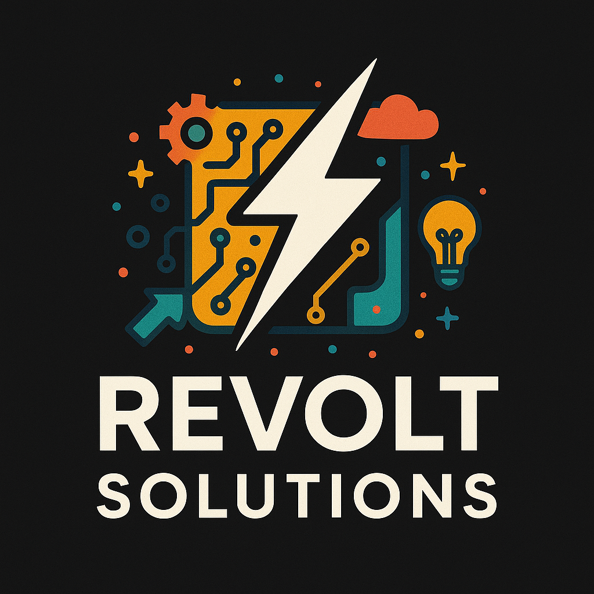

# API 2º Semestre - Banco de dados (Noturno).

      
      <h2 align="center"> Sprint 3</h2>

> Status da Sprint: Não Iniciada ❌

## 📋 Backlog da Sprint

| **US05** | Alta | Como orientador, quero corrigir e registrar feedback em cada seção enviada pelo aluno para acompanhar sua evolução. | 21 | 3 | RF05 RF06 | Em execução |
| **US02** | Média | Como administrador, quero atualizar automaticamente as relações entre alunos e professores ao importar um novo CSV, garantindo que o sistema reflita sempre a situação mais recente da turma. | 13 | 3 | RF03 RF06 | Não iniciado |
| **US06** | Média | Como professor-orientador, quero visualizar o histórico de revisões de cada seção para acompanhar a evolução do trabalho, evitando desperdício de tempo e garantindo melhor eficácia. | 5 | 1 | RF07 RF08| Concluido |
| **US07** | Baixa | Como professor de disciplina, quero visualizar o status de conclusão dos portfólios para identificar quais alunos já finalizaram todas as seções, reduzindo atrasos que podem gerar custos adicionais. | 13 | 3 | RF09 RF10 | Não iniciado |
| **US08** | Baixa | Como aluno, quero gerar automaticamente o TG final em formato Markdown (MD) para entregar de acordo com o padrão exigido pela instituição, economizando tempo e custos com formatação manual. | 21 | 3 | RF11 RF12 | Não iniciado |

## 🏅 DoR - Definition of Ready 

|             Critério             | Descrição                                                                                         |
| :------------------------------: | ------------------------------------------------------------------------------------------------- |
|         Definido o MVP           | Foi definido o mínimo produto viável com o cliente.                                               |
|   Entrega acordada com cliente   | Os requisitos a serem entregues foram alinhados com o cliente.                                    |
| Critérios de Aceitação Definidos | A história possui critérios objetivos que indicam o que é necessário para considerá-la concluída. |
| Cenários de Teste Especificados  | A história tem pelo menos 1 cenário de teste.                                                     |
|    Compreensão Compartilhada     | Toda a equipe (incluindo PO e devs) compreende o propósito da história.                           |
|            Estímável             | Todas as atividades tem tempo de ínicio e fim determinadas                                        |

## 🏅 DoD - Definition of Done 

|                 Critério                 | Descrição                                                                            |
| :--------------------------------------: | ------------------------------------------------------------------------------------ |
|             Código revisado              | O código foi revisado por pelo menos um colega de equipe.                            |
|     Documentação interna atualizada      | Foi atualizado o que for necessário: Documentos, US, Backlog, Integrantes e etc      |
|        Telas desenvolvidas testadas      | As interfaces foram testadas por todos membros.                                      |
|             Validação do PO              | O Product Owner validou a entrega com base nos critérios definidos.                  |
|            Pronto para deploy            | O item está testado, validado e pode ser integrado ao produto final.                 |

