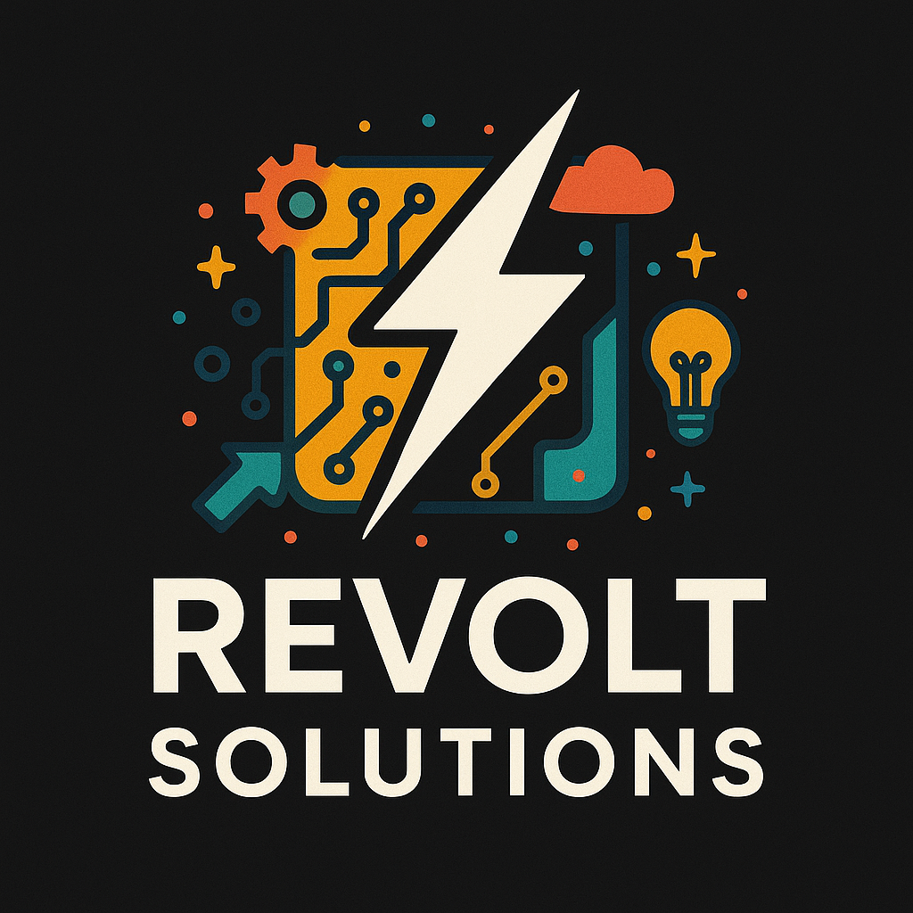
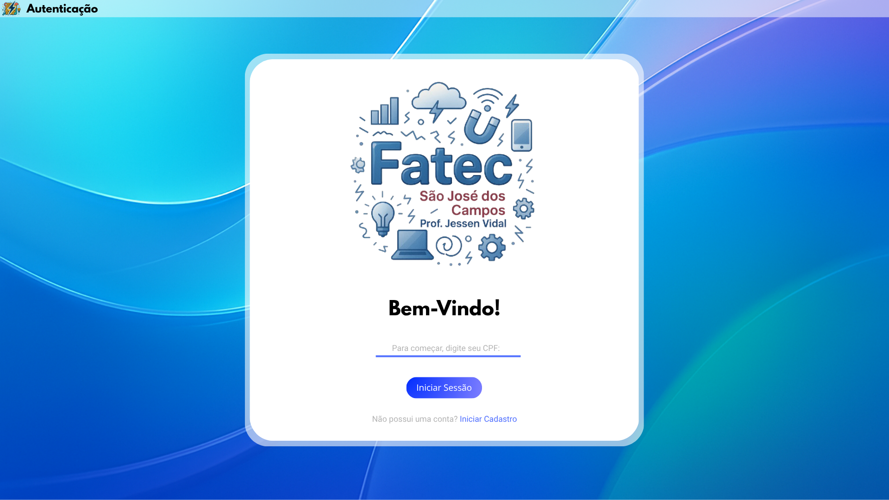

# API 2º Semestre - Banco de dados (Noturno).

      
      <h2 align="center"> Sprint 1</h2>

> Status do Projeto: Em andamento ⚙️ 
>

## 📋 Apresentação do primeiro protótipo 

      
      <h2 align="center"> Primeira Versão do Software TGRS, usando a Interface REGLASS</h2>

Nesta primeira Sprint, foi apresentado o primeiro protótipo do Design do Software, com 3 telas de demontração (apresentação, autenticação e inicio), para atender ao requisito do cliente de ter a ciencia de que a equipe é capaz de propor o que ele estava solicitando. Além disto, foi desenvolvido toda a documentação Inicial do projeto, como backlog, User Storys dentre outras necessidades técnicas propostas pela instituição.

## 🏅 DoR - Definition of Ready 

|             Critério             | Descrição                                                                                         |
| :------------------------------: | ------------------------------------------------------------------------------------------------- |
|       Clareza na Descrição       | A User Story está escrita no formato “Como [persona], quero [ação] para que [objetivo]”           |
| Critérios de Aceitação Definidos | A história possui critérios objetivos que indicam o que é necessário para considerá-la concluída. |
| Cenários de Teste Especificados  | A história tem pelo menos 1 cenário de teste.                                                     |
|    Compreensão Compartilhada     | Toda a equipe (incluindo PO e devs) compreende o propósito da história.                           |
|            Estímável             | A história estimada e acordada entre os intergrantes                                              |

## 🏅 DoD - Definition of Done 

|                 Critério                 | Descrição                                                                            |
| :--------------------------------------: | ------------------------------------------------------------------------------------ |
|             Código revisado              | O código foi revisado por pelo menos um colega de equipe.                            |
|     Documentação interna atualizada      | Foi atualizado o que for necessário: Documentos, US, Backlog, Integrantes e etc      |
|        Telas desenvolvidas testadas      | As interfaces foram testadas por todos membros                                       |
|             Validação do PO              | O Product Owner validou a entrega com base nos critérios definidos.                  |
|            Pronto para deploy            | O item está testado, validado e pode ser integrado ao produto final.                 |
